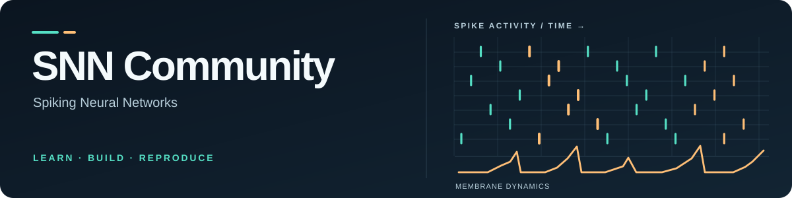

  <picture>
    <source media="(prefers-color-scheme: dark)" srcset="../assets/hero-dark.svg">
    <source media="(prefers-color-scheme: light)" srcset="../assets/hero-light.svg">
    
  </picture>

  <strong>Advancing Spiking Intelligence, Together.</strong>

  An open community connecting learners, researchers, and builders of <strong>Spiking Neural Networks</strong> and neuromorphic intelligence.

  <a href="https://snntorch.readthedocs.io/en/latest/tutorials/index.html">Start learning</a> ·
  <a href="https://github.com/SNNCommunity/.github/issues/new/choose">Share an idea</a> ·
  <a href="https://github.com/SNNCommunity/.github/blob/main/CONTRIBUTING.md">Contribute</a>

---

## Explore spiking intelligence

| **Learn & understand** | **Research & reproduce** |
| :--- | :--- |
| Neuron models, spike encoding, surrogate gradients, deep SNN architectures, and practical tutorials. | Papers, experimental protocols, transparent baselines, and careful comparisons. |
| **Build & optimize** | **Perceive & interact** |
| Open-source frameworks, numerical correctness, efficient GPU execution, and neuromorphic hardware. | Event-based vision, temporal learning, robotics, and spiking embodied intelligence. |

## Where to begin

**New to SNNs?** Explore established open tutorials from [snnTorch](https://snntorch.readthedocs.io/), [SpikingJelly](https://spikingjelly.readthedocs.io/), and [Norse](https://github.com/norse/norse). These are independent projects; links do not imply affiliation.

**Want to help shape this community?** [Propose a topic](https://github.com/SNNCommunity/.github/issues/new/choose), [improve community documentation](https://github.com/SNNCommunity/.github/issues), or read our [contribution guide](https://github.com/SNNCommunity/.github/blob/main/CONTRIBUTING.md).

**Interested in reproducible experiments?** Start with our [research and evaluation standards](https://github.com/SNNCommunity/.github/blob/main/RESEARCH_STANDARDS.md).

## Building in the open

SNNCommunity is in its **founding stage**. The following initiatives are being organized; links below are *open planning tasks*, not released projects.

- [Community discussions and collaboration hub](https://github.com/SNNCommunity/.github/issues/2)
- [Curated SNN resources and tutorials](https://github.com/SNNCommunity/.github/issues/3)
- [First reproducible SNN reference experiment](https://github.com/SNNCommunity/.github/issues/4)

**Good science is built together:** cite original contributions, reproduce what you can, make limitations visible, and welcome thoughtful technical disagreement.

---

[Roadmap](https://github.com/SNNCommunity/.github/blob/main/ROADMAP.md) ·
[Governance](https://github.com/SNNCommunity/.github/blob/main/GOVERNANCE.md) ·
[Code of Conduct](https://github.com/SNNCommunity/.github/blob/main/CODE_OF_CONDUCT.md) ·
[Support](https://github.com/SNNCommunity/.github/blob/main/SUPPORT.md) ·
[Security](https://github.com/SNNCommunity/.github/blob/main/SECURITY.md)

Independent, community-driven initiative. Not an official university or corporate organization.
