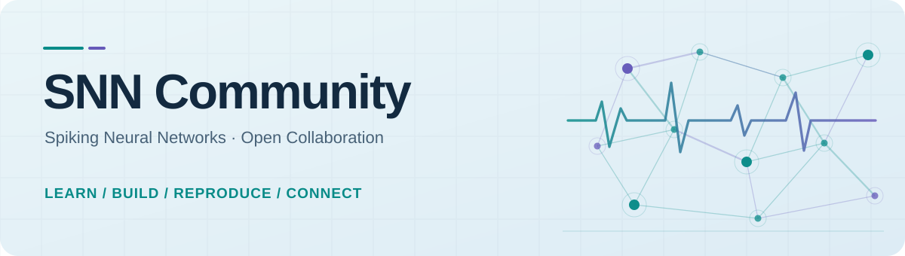

  <picture>
    <source media="(prefers-color-scheme: dark)" srcset="../assets/hero-dark.svg">
    <source media="(prefers-color-scheme: light)" srcset="../assets/hero-light.svg">
    
  </picture>

<h3 align="center">From spikes to systems.</h3>

  <strong>SNN Community</strong> is an independent home for people learning, researching, and building with spiking neural networks and neuromorphic computing.

  <a href="https://github.com/SNNCommunity/.github/tree/main/docs">Interactive portal source</a> ·
  <a href="https://github.com/SNNCommunity/.github/issues">Join an open task</a> ·
  <a href="https://github.com/SNNCommunity/.github/blob/main/CONTRIBUTING.md">How to contribute</a>

---

### Explore the science

**Learn** · Understand spikes, temporal encoding, surrogate gradients, deep SNNs and event-driven perception through the [snnTorch tutorials](https://snntorch.readthedocs.io/) and [SpikingJelly documentation](https://spikingjelly.readthedocs.io/).

**Experiment** · Explore an interactive LIF neuron and a curated, searchable research collection in our [next-generation portal source](https://github.com/SNNCommunity/.github/tree/main/docs). **The website's public URL is pending GitHub Pages activation**; see the [deployment guide](https://github.com/SNNCommunity/.github/blob/main/PORTAL.md).

**Build together** · Propose resources, improve documentation and support open, reproducible experiments through [public contributions](https://github.com/SNNCommunity/.github/issues).

### Open initiatives

| Collaboration | Current progress |
| --- | --- |
| [Community discussion hub](https://github.com/SNNCommunity/.github/issues/2) | Planning |
| [SNN resource collection](https://github.com/SNNCommunity/.github/issues/3) | Initial external references in portal |
| [Reproducible reference experiment](https://github.com/SNNCommunity/.github/issues/4) | Planning |
| [Interactive SNN portal](https://github.com/SNNCommunity/.github/blob/main/PORTAL.md) | Code ready; deployment pending |

We publish the state of our work as it is. Our learning links reference independent third-party projects and do not imply affiliation or endorsement. SNNCommunity is not an official university or corporate organization.

[Roadmap](https://github.com/SNNCommunity/.github/blob/main/ROADMAP.md) · [Research standards](https://github.com/SNNCommunity/.github/blob/main/RESEARCH_STANDARDS.md) · [Governance](https://github.com/SNNCommunity/.github/blob/main/GOVERNANCE.md) · [Security](https://github.com/SNNCommunity/.github/blob/main/SECURITY.md)
